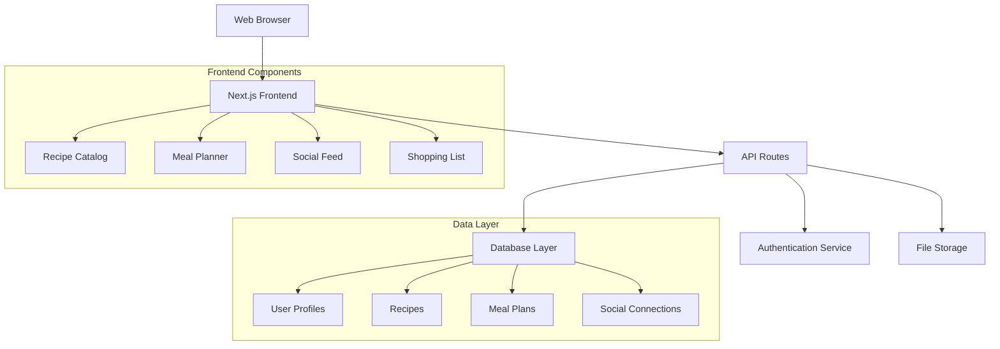
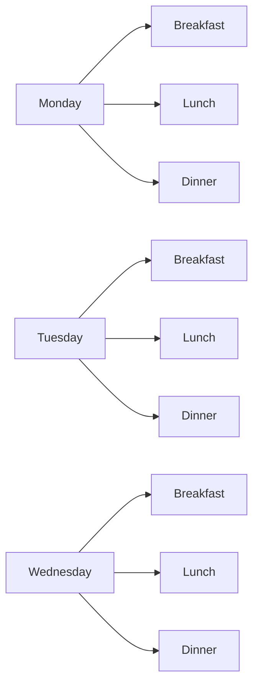
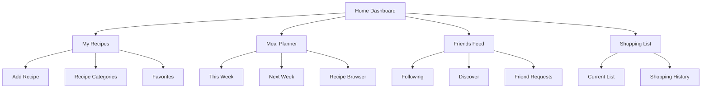

# Design Document

## Overview
DormChef is a mobile-first web application designed specifically for male college students who want to cook affordable, healthy meals in small kitchens. The design emphasizes simplicity, social connection, and user-friendliness while maintaining a professional appearance that builds trust and credibility.

### Design Philosophy
- **Mobile-First**: Optimized for one-handed use with thumb-zone accessibility
- **Social-Native**: Easy sharing and community features inspired by modern social platforms
- **Minimalist Professional**: Clean, uncluttered interface with bold accents
- **Male College Aesthetic**: Contemporary design elements that resonate with the target demographic

## Architecture

### System Architecture


### Technology Stack
- **Frontend**: Next.js 14 with React 18, TypeScript
- **Styling**: Tailwind CSS with custom component library
- **Database**: PostgreSQL with Prisma ORM
- **Authentication**: NextAuth.js
- **Hosting**: Vercel
- **File Storage**: Cloudinary for recipe images

## Components and Interfaces

### Design System

#### Color Palette
- **Primary**: Deep Navy (#1E293B) - Professional, trustworthy
- **Secondary**: Forest Green (#15803D) - Fresh, healthy
- **Accent**: Electric Orange (#F97316) - Energy, appetite appeal
- **Neutral**: Warm Gray (#64748B) - Text and backgrounds
- **Success**: Bright Green (#10B981)
- **Warning**: Amber (#F59E0B)
- **Error**: Red (#EF4444)

#### Typography
- **Primary Font**: Inter (clean, modern, highly readable)
- **Display Font**: Poppins Bold (headings and CTAs)
- **Code Font**: JetBrains Mono (for measurements and times)

#### Visual Hierarchy
- **H1**: 32px Poppins Bold (page titles)
- **H2**: 24px Poppins Semibold (section headers)
- **H3**: 20px Inter Semibold (component titles)
- **Body**: 16px Inter Regular (primary text)
- **Small**: 14px Inter Regular (meta information)

### Core Components

#### 1. Recipe Card Component
```typescript
interface RecipeCard {
  id: string;
  title: string;
  image?: string;
  prepTime: number;
  difficulty: 'Easy' | 'Medium' | 'Hard';
  tags: string[];
  authorName?: string;
  isFavorite: boolean;
}
```

**Design Features:**
- Rounded corners (12px radius) for modern feel
- Subtle shadow for depth
- Drag handle indicator for meal planning
- Quick action buttons (favorite, copy, share)
- Color-coded difficulty indicators

#### 2. Weekly Meal Planner Grid


**Design Features:**
- Bento grid layout for organized information display
- Drop zones with clear visual feedback
- Magnetic snapping for precise placement
- Swipe gestures for mobile navigation
- Color coding for meal types

#### 3. Social Feed Interface
**Design Features:**
- Instagram-inspired card layout
- Large recipe images with overlay text
- Quick action buttons (like, copy, comment)
- User avatars and attribution
- Infinite scroll with lazy loading

### User Interface Layouts

#### Mobile Layout (Primary)
- **Header**: Fixed navigation with search and profile
- **Main Content**: Full-width cards with generous spacing
- **Bottom Navigation**: Sticky tab bar with 4 primary sections
- **Floating Action Button**: Quick recipe add button

#### Desktop Layout (Secondary)
- **Sidebar Navigation**: Collapsible menu with all major sections
- **Main Content Area**: Grid layout with responsive columns
- **Right Panel**: Context-sensitive actions and information
- **Top Bar**: Search, notifications, and user controls

### Navigation Structure


## Data Models

### User Model
```typescript
interface User {
  id: string;
  email: string;
  username: string;
  displayName: string;
  avatarUrl?: string;
  school?: string;
  dietaryRestrictions: string[];
  createdAt: Date;
  updatedAt: Date;
}
```

### Recipe Model
```typescript
interface Recipe {
  id: string;
  title: string;
  description?: string;
  imageUrl?: string;
  ingredients: Ingredient[];
  instructions: string[];
  prepTime: number; // minutes
  cookTime: number; // minutes
  servings: number;
  difficulty: 'Easy' | 'Medium' | 'Hard';
  tags: string[];
  authorId: string;
  isPublic: boolean;
  createdAt: Date;
  updatedAt: Date;
}

interface Ingredient {
  name: string;
  amount: number;
  unit: string;
  category: string; // for shopping list organization
}
```

### Meal Plan Model
```typescript
interface MealPlan {
  id: string;
  userId: string;
  weekStartDate: Date;
  meals: PlannedMeal[];
  createdAt: Date;
  updatedAt: Date;
}

interface PlannedMeal {
  day: number; // 0-6 (Sunday-Saturday)
  mealType: 'breakfast' | 'lunch' | 'dinner';
  recipeId: string;
}
```

### Social Connection Model
```typescript
interface Friendship {
  id: string;
  requesterId: string;
  addresseeId: string;
  status: 'pending' | 'accepted' | 'declined';
  createdAt: Date;
  updatedAt: Date;
}
```

## Error Handling

### Client-Side Error Management
- **Network Errors**: Retry mechanisms with exponential backoff
- **Validation Errors**: Real-time form validation with clear messaging
- **Authentication Errors**: Automatic redirect to login with context preservation
- **Data Sync Errors**: Offline-first approach with conflict resolution

### Error States Design
- **Empty States**: Encouraging illustrations with clear CTAs
- **Loading States**: Skeleton screens matching actual content layout
- **Error States**: Friendly messages with recovery options
- **Network Offline**: Cached content with sync indicators

### User Feedback Patterns
```typescript
interface ToastNotification {
  type: 'success' | 'warning' | 'error' | 'info';
  title: string;
  message: string;
  duration: number;
  action?: {
    label: string;
    handler: () => void;
  };
}
```

## Testing Strategy

### Unit Testing
- **Component Testing**: React Testing Library for UI components
- **Utility Testing**: Jest for business logic and data transformations
- **API Testing**: Supertest for endpoint validation
- **Database Testing**: Isolated test database with seed data

### Integration Testing
- **User Flows**: Cypress for critical user journeys
- **API Integration**: End-to-end testing of data flow
- **Authentication**: Login/logout and session management
- **Social Features**: Friend connections and recipe sharing

### Performance Testing
- **Page Load Speed**: Target <3 seconds on 3G networks
- **Image Optimization**: WebP format with progressive loading
- **Bundle Size**: Code splitting to keep initial load <100KB
- **Mobile Performance**: 60fps animations and smooth scrolling

### User Experience Testing
- **A/B Testing**: Feature flag system for design experiments
- **Usability Testing**: Regular sessions with target demographic
- **Accessibility Testing**: WCAG 2.1 AA compliance
- **Cross-Device Testing**: Responsive design validation

### Accessibility Features
- **Keyboard Navigation**: Full app navigation without mouse
- **Screen Reader Support**: Proper ARIA labels and semantic HTML
- **High Contrast Mode**: Alternative color scheme for visual impairments
- **Text Scaling**: Support for browser zoom up to 200%
- **Motion Reduction**: Respect for reduced motion preferences

### Mobile-Specific Considerations
- **Touch Targets**: Minimum 44px for easy tapping
- **Gesture Support**: Swipe navigation and pinch-to-zoom
- **Haptic Feedback**: Subtle vibrations for drag-and-drop actions
- **Offline Functionality**: Core features work without internet
- **Battery Optimization**: Efficient data usage and processing

This design document creates a foundation for a modern, user-friendly meal planning application that specifically appeals to male college students while maintaining professional design standards and accessibility best practices.